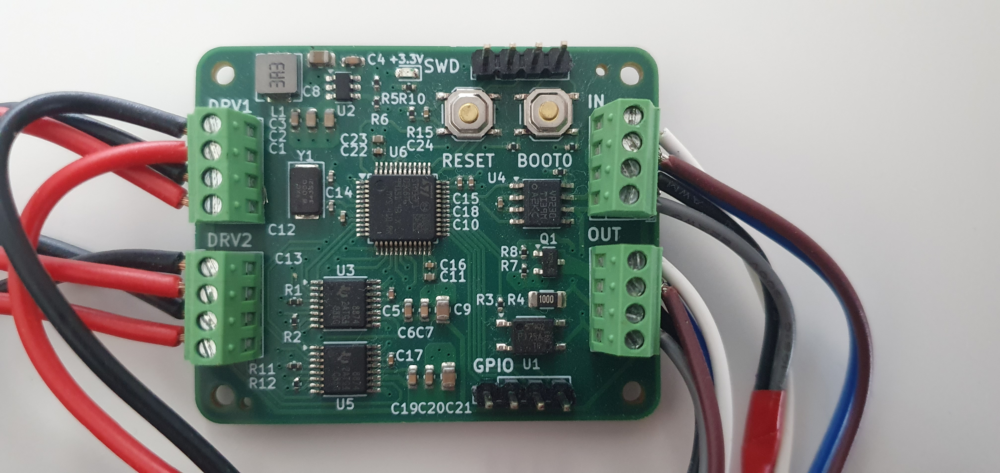

# NutriDoser - Modular nutrient and pH controller for hydroponics

**NutriDoser** is and open-source prototype of an modular and extensible hydroponics reservoir controller.
Most devices on the market have limited capabilites on the number of nutrients that can be scheduled, but there's no limit with NutriDoser.
**DoserModules** can be daisy chained and controller detects how many of these modules there are and a scheduler takes care that no more than **n** parallel dosers are running.

> ⚠️ **Disclaimer:** This project is still at prototyping stage and should not be used without supervising.

---

## ✨ Key Features

- **Connect unlimited number of dosing pumps**
- **Web interface**
- **Custom PCB that's designed to use mostly basic parts from JLCPCB**
- **Automatic CAN termination**

---

## 🌐 Demo

Coming soon...

---

## ⚙️ Stack

- **C++** – Embedded code
- **Javascript + React** – Web interface
- **KiCad** – Hardware design
- **ESP32**
- **STM32**
